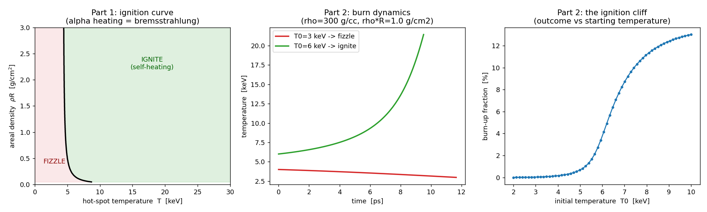

# 0-D Hot-spot ignition

A zero-dimensional DT hot spot: **alpha self-heating** vs **bremsstrahlung
loss**, with **alpha confinement** set by the areal density ρR. Fusion
reactivity is the Bosch–Hale fit (accurate 0.2–100 keV), so the numbers are
quantitative, not hand-waved.

```bash
python3 hotspot_0d.py
```



**What it shows**

1. **Ignition curve** (T vs ρR) — the boundary where alpha heating overtakes
   radiation. Below ~4.3 keV you cannot ignite at any density.
2. **Burn dynamics** — same ρR, 4 keV decays (fizzle) while 6 keV runs away to
   21 keV (ignite). Same physics, 2 keV apart.
3. **The ignition cliff** — burn-up vs starting temperature: flat and negligible,
   then it rockets up over a ~1 keV window.

Headline result: the ideal ignition temperature falls out at **4.35 keV** from
the alpha-vs-bremsstrahlung balance — the textbook value, not a hardcoded input.

See the `NOTES` block at the bottom of `hotspot_0d.py` for the knobs and the
deliberate simplifications (single temperature, optically thin, no electron
conduction, fixed confinement window).
