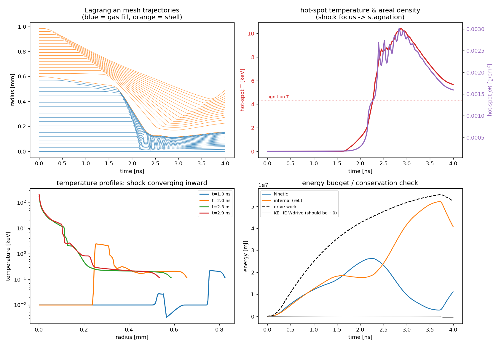
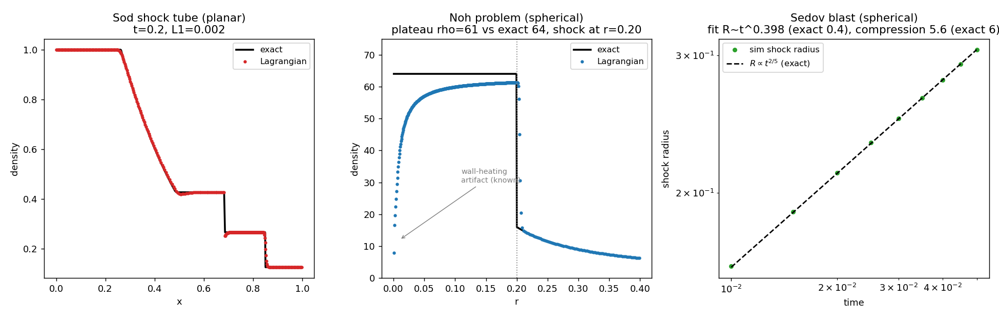

# 1-D Lagrangian hydrodynamics

A spherical **1-D Lagrangian hydro** solve of an ICF implosion. Where the
[0-D hot-spot](../0-D%20Hotspot) and [rocket](../Rocket%20Implosion) models
*estimate* the stagnation state, this one *computes* it from the PDEs: a dense
DT shell is driven inward, acts as a piston on the central gas fill, and launches
a shock that **converges on the origin** to form the hot spot, then rebounds.

```bash
python3 lagrangian_1d.py
```



**Numerics** — the classic staggered-grid scheme (von Neumann & Richtmyer,
Wilkins): fixed Lagrangian mass zones, nodes carrying radius/velocity,
artificial viscosity for shock capture, ideal-gas EOS (γ = 5/3), reflecting
center and pressure-driven outer boundary. First-order-in-time, ~220 mass zones.

**What the panels show**
- **top-left** — Lagrangian mesh trajectories. Watch the orange shell implode
  and the blue fill lines pinch at `r = 0`: that pinch is the converging shock
  forming the hot spot.
- **top-right** — hot-spot temperature and areal density rising at stagnation.
- **bottom-left** — temperature profiles: the shock sweeping inward in radius.
- **bottom-right** — energy budget. `KE + IE − drive work ≈ 0` is the validity
  check.

**Results (150 Mbar drive):**

| quantity | value |
|---|---|
| time to stagnation | 2.9 ns |
| fuel convergence ratio | 8.7 |
| peak hot-spot density | 1.65 g/cc |
| hot-spot temperature (mass-avg) | **10.4 keV** |
| hot-spot areal density | 0.003 g/cm² |
| **energy conservation drift** | **−0.9%** |

**Reading the result honestly.** The hot spot gets *hot* (10 keV — clears the
4.3 keV ignition temperature) but not *dense* (ρR ≪ 0.3 g/cm²). That is the
correct signature of a **lossless, single-shock** toy: with no ablative
compression and no shaped pulse, the shell only converges ~9×, so areal density
stays low. Building ρR is exactly what the rocket model's ablation and the 0-D
model's assumed compression buy you. The central-zone "329 keV" is the
[Guderley](https://en.wikipedia.org/wiki/Guderley%E2%80%93Landau%E2%80%93Stanyukovich_problem)
converging-shock singularity — a numerical artifact of a point focus, which is
why the physical measure is the mass-averaged hot-spot temperature.

**Validation.** Energy conservation to ≈1% (the artificial-viscosity leak) is
one error bar. The stronger check is `hydro_validation.py`, which runs the *same
scheme* against three problems with exact solutions:

```bash
python3 hydro_validation.py
```



| test | geometry | result |
|---|---|---|
| **Sod shock tube** | planar | L1 density error **0.0015** vs exact Riemann solution |
| **Noh problem** | spherical | shock at exactly r=0.20; post-shock plateau ρ=**61** (exact 64) |
| **Sedov blast** | spherical | R∝t^**0.398** (exact 0.4); compression **5.6** (exact 6) |

Sod exercises a shock, contact discontinuity, and rarefaction at once; Noh a
converging stagnation shock (its central density dip is the famous **Noh
wall-heating** artifact that every standard Lagrangian code shows); Sedov a
strong diverging blast. Passing these means the ICF results — and any ML trained
on this solver — rest on a *verified* scheme, not a plausible-looking one.

Simplifications (biggest first) are in the `NOTES` block of `lagrangian_1d.py`:
no radiation transport or conduction, ideal-gas EOS, single temperature, no
burn, and — being 1-D — **no Rayleigh–Taylor instability**, the real spoiler of
hot-spot formation.
