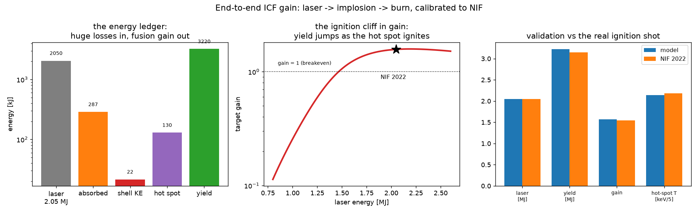
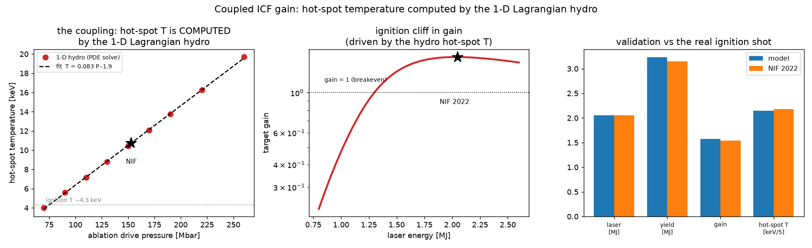
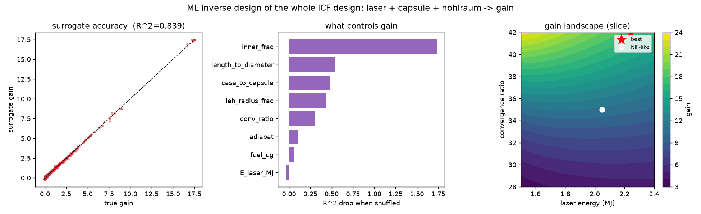
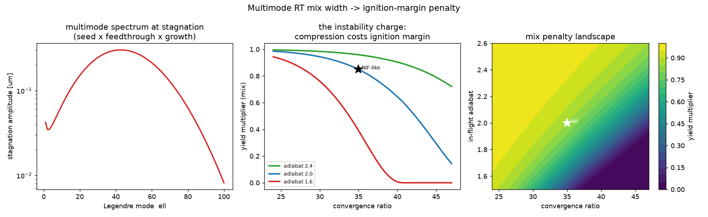
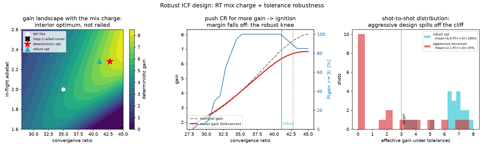

# End-to-end gain — the number that matters

Every other model in this repo covers one stage of an implosion. This one chains
them into a single forward model — **`design → gain`** — and pins the free coupling
efficiencies so that a NIF-scale design reproduces the **real December 2022
ignition shot** (N221204).

```bash
python3 gain_model.py
```



## The energy ledger

```
laser energy
  × eta_hohlraum   laser  → X-rays absorbed by the capsule
  × eta_rocket     absorbed → imploding-shell kinetic energy
  → stagnation     KE → hot-spot temperature;  convergence → areal density
  → burn           0-D Hotspot model → burn-up fraction        (reused)
  → fusion yield   burn-up × fuel × 17.6 MeV
gain = yield / laser energy
```

The chasm between the stages is the whole story of why ICF is hard: of 2 MJ of
laser, ~14% is absorbed, ~1% becomes shell kinetic energy — and yet, once the hot
spot ignites, the fusion yield comes back **larger than the laser energy**.

## Calibrated to the real ignition point

The two coupling efficiencies and the stagnation/burn coefficients are set **once**
so the reference design lands on NIF N221204. Everything downstream — the ignition
cliff in gain, the sensitivity of gain to implosion velocity — then falls out of
the 0-D burn:

| quantity | model | NIF N221204 |
|---|---|---|
| laser energy | 2.05 MJ | 2.05 MJ |
| fusion yield | **3.22 MJ** | 3.15 MJ |
| target gain | **1.57** | 1.54 |
| hot-spot temperature | **10.7 keV** | ~10.9 keV |
| burn-up fraction | 4.5 % | ~4 % |

All within ~2%.

## Why it matters

This is the **integrating layer** for the repo. Implosion velocity comes from the
rocket / convergent models, drive symmetry from the hohlraum view factor, and yield
degradation from the asymmetry model — all feeding this one `design → gain` forward
model that the ML can then optimize *end to end*, against the metric fusion actually
cares about.

## What this is and isn't

A reduced, calibrated model — not a radiation-hydrodynamics code. It will not
resolve a mix layer or a real hohlraum drive history. Its value is being a fast,
transparent, end-to-end surrogate that is *anchored to reality*: change the design
and watch gain move, with every simplification written down in the `NOTES`.

## Coupled model — the hot-spot temperature is now *computed*, not fit

`gain_model.py` estimates the stagnation temperature with a single scaling,
`T_hs = K · v_imp²`. **`coupled_gain.py`** removes that fit: it drives the repo's
**1-D Lagrangian hydro** at an ablation pressure set by the laser energy and reads
the *computed* hot-spot temperature straight off the converging shock.

```bash
python3 build_hydro_table.py   # one-time: run the hydro across drive pressures
python3 coupled_gain.py        # fit T_hs(P_drive), evaluate gain
```



The hydro lands on **10.7 keV at NIF-scale drive with no temperature knob at all** —
an independent confirmation of the energy ledger — and the coupled model still
reproduces N221204 within ~3% (yield 3.23 MJ, gain 1.58). Only ρR stays calibrated:
the lossless single-shock toy reaches ignition *temperature* but builds almost no
areal density (ρR ~ 0.003 vs the ~1 g/cm² needed), so temperature — the ignition
trigger — is what we take from it. Strong-shock heating makes `T_hs` linear in drive
pressure, exactly as the sampled hydro points show.

## Whole-design ML — laser + capsule + hohlraum → gain

**`whole_design_ml.py`** optimizes the *entire* design against gain, not just
hohlraum geometry. It chains the two forward models the repo now has —
`coupled_gain` (laser + capsule → gain₀) and the view-factor → convergent-RT chain
(hohlraum → YOC) — and learns a surrogate over the 8-D design space, with the same
active-learning loop (propose surrogate optimum → verify against physics → refit).



Two results worth calling out: **laser energy barely matters** (permutation
importance ≈ 0) — above the ignition cliff, gain is set by capsule compression and
drive symmetry, not by piling on more laser. And the optimizer rails convergence
high / adiabat low / fuel high, because the reduced model rewards compression
without charging for the Rayleigh–Taylor instability it costs — which is exactly the
penalty **Step 3** adds.

## Step 3 — the instability charge + robust design

Step 2's optimizer railed because nothing charged for the Rayleigh–Taylor mix that
aggressive compression buys. Step 3 supplies that charge and then optimizes for
*robust* gain under tolerances.

```bash
python3 build_rt_table.py     # one-time: cache the RT growth spectrum vs CR
python3 rt_mix.py             # multimode mix width -> ignition-margin penalty
python3 robust_design_ml.py   # whole-design optimum + chance-constrained robust design
```



**`rt_mix.py`** turns a capsule surface-roughness *spectrum* into a stagnation mix
width and a yield multiplier: the seed roughness is amplified by acceleration-phase
ablative feedthrough (worse at low adiabat), then by deceleration RT + Bell–Plesset
convergence (`convergent_rt`, cached over CR), summed over modes, and cut off at
short wavelength by the finite interface thickness. Convergence enters as `f_mix ~
CR²` (Bell–Plesset amplitude × a shrinking hot spot). Calibrated so the NIF-like
nominal keeps **85%** of clean yield — mix-degraded but igniting, as N221204 was —
while Step 2's aggressive corner (CR 44, adiabat 1.6) is **fully quenched**.



**`robust_design_ml.py`** folds that penalty into the objective (as a factor relative
to nominal, preserving the anchor) and re-optimizes. Two payoffs:

- **The optimum stops railing.** With the mix charge the deterministic optimum sits
  at an *interior* CR ≈ 43 / adiabat ≈ 2.3 — a genuine ignition-margin sweet spot —
  instead of Step 2's railed CR 45 / adiabat 1.6 corner.
- **Robustness matters.** A real shot scatters — surface finish, drive symmetry,
  adiabat, delivered energy. Monte-Carlo over those tolerances shows the
  gain-optimal design sits on the cliff shoulder: nominal gain 7.6, but **std 1.9**
  and only **90%** of shots clear a useful-yield bar. A **chance-constrained** robust
  design that backs convergence off to CR ≈ 41 trades ~8% nominal gain for **std 1.3,
  100%** margin and a higher worst case — "max gain" becomes "max *robust* gain," the
  number a real ignition program optimizes.

The next open piece is **Step 4** — a proper UQ (Sobol indices, tolerance→yield
variance) to rank *which* spec drives the scatter, turning these tolerances into
engineering requirements.
