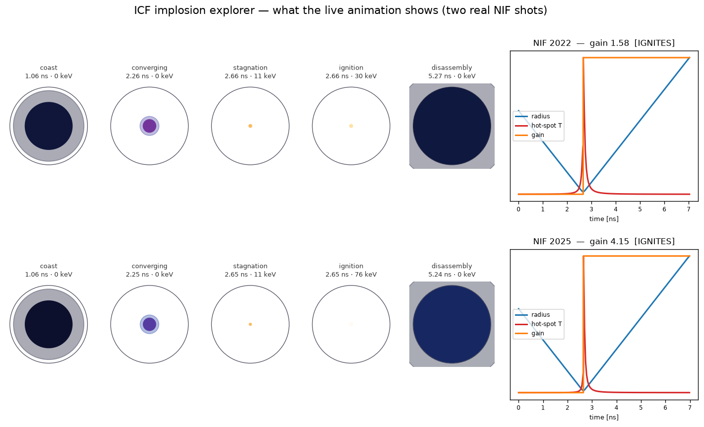

# Interactive implosion explorer

A live, in-browser animation of an ICF shot: set the laser and capsule, watch the
shell implode, stagnate, and ignite — or fizzle. Reduced, NIF-anchored physics, no
backend.



## Run it

ES modules need to be served over HTTP (not opened as a `file://`):

```bash
cd "Gain Model/web"
python3 -m http.server 8731
# open http://localhost:8731/
```

Drag the sliders (laser energy, fuel, convergence, adiabat, surface finish), press
**Play**, or hit a **preset** — the two real NIF shots (2022, gain 1.5; 2025, gain
4.1). Same laser energy; the jump to gain 4 comes from a better capsule.

## What's here

| file | role |
|---|---|
| `implosion_timeline.js` | the physics engine — a JS port of `../implosion_timeline.py`, exact to <0.05% |
| `timeline_data.js` | hydro fit + RT growth-factor table, auto-generated from the cached JSONs |
| `index.html` | the animation UI (canvas capsule + R/T/gain sparklines + controls) |
| `verify.mjs` | `node web/verify.mjs` — diffs the JS engine against the pinned Python `reference.json` |
| `preview.py` | renders the filmstrip above from the same model |

`simulate(design)` is the shared contract: identical inputs → identical time series in
Python and JavaScript. This is the same engine that will drive the portfolio page.
