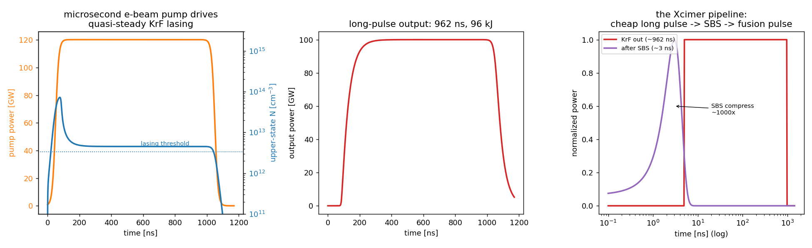
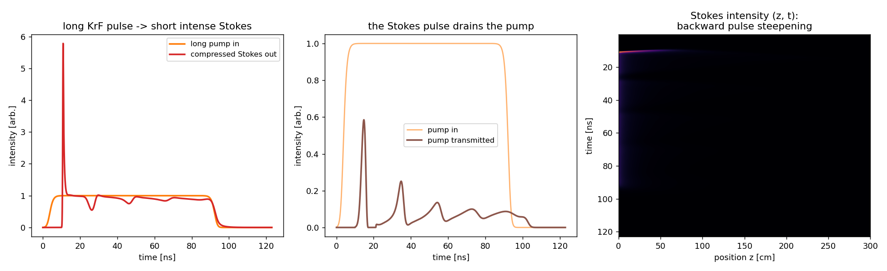
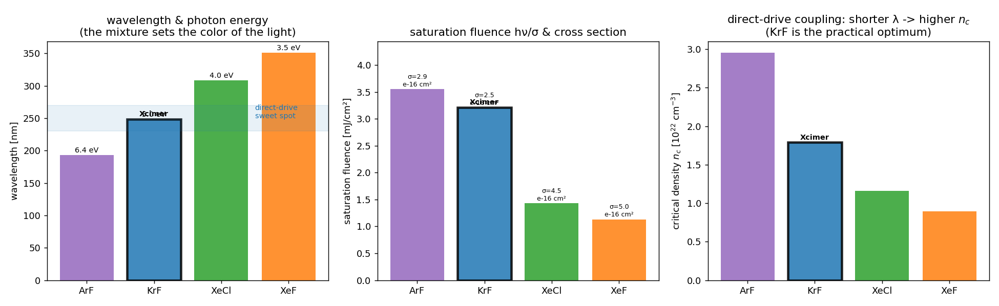

# Lasers & pulse compression — the Xcimer Energy architecture

Three toy models of the laser hardware behind [Xcimer Energy](https://xcimer.energy)'s
inertial-fusion-energy driver: a **KrF excimer amplifier**, its **SBS
pulse-compression cell**, and a comparison of **excimer gas mixtures** that
motivates their choice of KrF.

Xcimer's core idea is counterintuitive: generate a cheap, low-peak-power
**microsecond** KrF pulse in a big e-beam amplifier (they hold the record for the
longest KrF laser pulse), keeping the optics far below damage threshold, then
compress it **~1000× down to ~3 ns** with stimulated Brillouin scattering in a
**low-pressure noble gas** — concentrating the power only *after* the expensive
optics. That is what drives $/joule down. Roadmap: Phoenix (2026) → Anvil (200 kJ,
2028) → Vulcan (4–12 MJ, early 2030s).

## `excimer_laser.py` — KrF long-pulse amplifier (Argos-class)

A gain-switched-then-steady KrF (248 nm) oscillator via the two laser rate
equations, configured for Xcimer's long-pulse regime.

- **962 ns** (≈ µs) flat-top output, **95.8 kJ** at **3.8 J/cm²** — Argos-class
  (>100 kJ), on a ~1.6 × 1.6 m aperture
- inversion clamps at threshold for the quasi-steady µs pulse; **80% extraction**
- panel 3 sketches the full pipeline: cheap long pulse → SBS → ~3 ns fusion pulse

The key point: peak power stays in the ~100 GW range (not TW), so the amplifier
optics never see damaging intensity — the fusion-relevant power only appears
after compression.

## `sbs_compression.py` — SBS compression in noble gas

Transient SBS (three coupled envelopes, counter-propagating) in the **strongly
damped** regime Xcimer uses. A long KrF pump stimulates a backward Stokes wave;
the Stokes leading edge sees fresh pump and is amplified hard while the tail
starves, so it compresses toward the phonon lifetime.

- **~140× compression** (88 ns → 0.64 ns) at **~89% energy efficiency**, in a
  low-pressure noble gas cell
- the sharp pump leading edge drives the compression; panel 2 shows the
  pump-depletion train as the Stokes sweeps up the pump

**Honest scope:** this plane-wave toy reproduces the transient-SBS *mechanism*,
the ~100× compression, and the ~90% efficiency, but the exact compressed width
should be read as ~τ_B (its physical floor). Xcimer's full **1000× (µs → ~3 ns)**
uses noise-initiated single-pulse selection and a focusing geometry beyond a
plane-wave model — see the `NOTES`.

## `excimer_mixtures.py` — why KrF?

Runs the same oscillator for **ArF (193 nm), KrF (248 nm), XeCl (308 nm), XeF
(351 nm)**. The finding is honest and specific: the mixtures are **dynamically
nearly identical** (~83–85% extraction, same pulse shape) — the choice is *not*
about laser performance, it's about the **wavelength the plasma sees**. Shorter
wavelength raises the critical density (panel 3), couples to the ablator more
efficiently, and suppresses laser-plasma instabilities. ArF (193 nm) is best on
that axis but pays in efficiency and optics lifetime, so **KrF at 248 nm is the
practical optimum** — Xcimer's (and NRL Nike's) choice.

## Caveats

Lumped/plane-wave toys with representative literature constants: single-mode
cavity and fixed effective upper-state lifetime for the excimer (real KrF is an
e-beam plasma-chemistry network), and a plane-wave, DC-seeded SBS model. Each
file's `NOTES` block lists the knobs and omitted physics.
