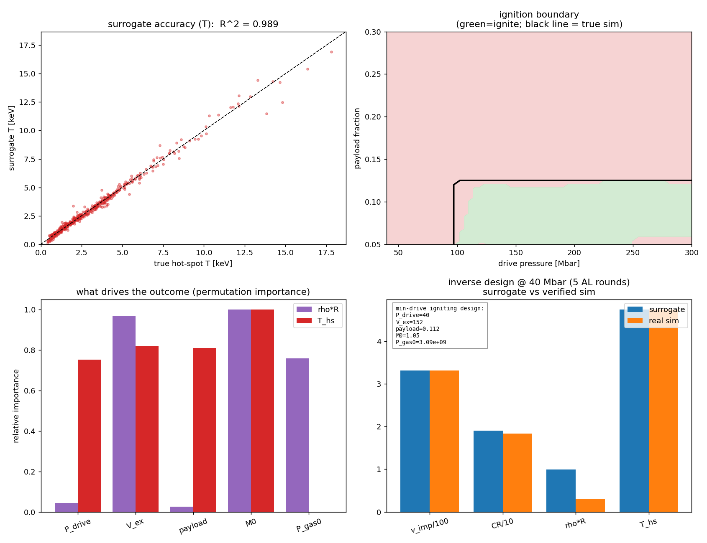
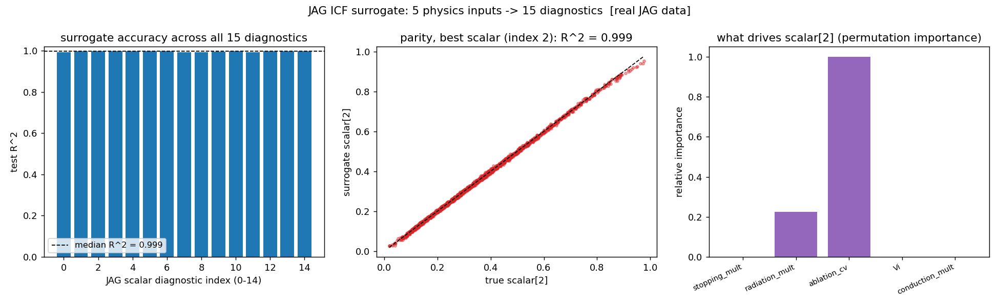

# ML surrogate for ICF ignition

The data-driven layer — and the reason this repo lives under `ML_NeuralNets`.
This is the miniature version of what LLNL's "cognitive simulation" program does
with full rad-hydro codes: sample a simulator across its design space, train a
fast neural-network surrogate, and then get the ignition boundary, sensitivity,
and inverse design *almost for free* — no simulation per question.

Here the "simulator" is the repo's [rocket-implosion model](../Rocket%20Implosion)
— cheap and fully understood, so the ML can be trusted and debugged. Swap
`forward()` for MULTI or HYDRA and the exact same pipeline is the real thing.

```bash
python3 ml_ignition.py      # generates + caches the dataset, then trains
```



## Pipeline

1. **Sample** 5 design knobs (drive pressure, exhaust velocity, payload fraction,
   shell mass, gas-cushion pressure) by Latin hypercube; run the rocket model on
   each → 2500 `(design → outcome)` pairs (~21% ignite).
2. **Train** an MLP surrogate mapping design → (implosion velocity, convergence,
   ρR, hot-spot T). Test-set accuracy:

   | output | R² |
   |---|---|
   | implosion velocity | 0.99 |
   | convergence ratio | 0.99 |
   | ρR | 0.99 |
   | hot-spot T | 0.99 |

   Ignition (T ≥ 4.3 keV and ρR ≥ 0.3) is classified at **~97% accuracy**.
3. **Ignition boundary** (top-right): the surrogate's ignite/fizzle region in a
   2D slice, with the *true simulator* boundary (black line) overlaid — they
   agree. You need enough drive **and** a small enough payload.
4. **Sensitivity** (bottom-left): permutation importance recovers the
   rocket-equation physics from data — velocity/temperature ride on exhaust
   velocity and payload; ρR rides on the shell mass and gas cushion.
5. **Inverse design with active learning** (bottom-right): minimize drive
   pressure subject to ignition.

## The interesting part: the surrogate lies, so we verify

The first inverse-design proposal was **over-optimistic** — the optimizer found a
40 Mbar design the surrogate *claimed* would ignite (T ≈ 5.2 keV), but running the
actual simulator gave T ≈ 3.8 keV: a **fizzle**. This is the classic failure of
surrogate optimization — the optimizer seeks out exactly the under-sampled
corners where the surrogate is optimistic.

The fix is the real ICF-ML workflow: **propose → simulate → refit**. Each failed
proposal is verified against the simulator, its neighborhood is sampled and
labeled, the surrogate is retrained, and the search repeats. After a few rounds
it converges to a design that is **verified to genuinely ignite** (real-sim
ρR = 0.31 ≥ 0.30, T = 4.7 ≥ 4.3). The surrogate still slightly over-predicts ρR
at this extreme-corner design — which is precisely why every proposed design is
checked against the simulator rather than trusted.

## Same pipeline, real ICF data — `jag_surrogate.py`

The point of learning the methodology on a toy is that it transfers. This script
runs the same surrogate pipeline on LLNL's open **[JAG dataset](https://github.com/LLNL/macc)**
— 10,000 semi-analytic ICF implosions mapping 5 physics inputs (`stopping_mult`,
`radiation_mult`, `ablation_cv`, `Vi`, `conduction_mult`) to 15 scalar
diagnostics — and it works essentially unchanged:



- **median test R² = 0.999** across all 15 real diagnostics (worst 0.993)
- the sensitivity panel recovers real physics from data (e.g. diagnostic #2 is
  driven mostly by `ablation_cv`, secondarily `radiation_mult`)

```bash
git clone https://github.com/LLNL/macc
mkdir -p jag_data && tar -xzf macc/data/icf-jag-10k.tar.gz -C jag_data
python3 jag_surrogate.py --data jag_data     # or --synthetic to smoke-test
```

The script auto-detects the input/scalar arrays by shape, so it doesn't depend on
file names. The honest difference from the rocket case: JAG is a *fixed dataset*,
not a callable simulator — so a proposed design can't be re-verified by
re-running it (the active-learning loop above needed that). Closing that gap is
what a live code like MULTI-IFE is for.

## Where this goes next

- **Multi-fidelity / transfer learning** — pre-train on this cheap model,
  fine-tune on a handful of MULTI runs (Kustowski et al.).
- **Bayesian calibration** — correct the model against experimental shot data.
- **Uncertainty-guided active learning** — sample where the surrogate is least
  certain near the boundary, not just around the last failure.

`NOTES` at the bottom of `ml_ignition.py` has the details. The dataset caches to
`rocket_dataset.npz` (git-ignored; regenerates in ~90 s).
