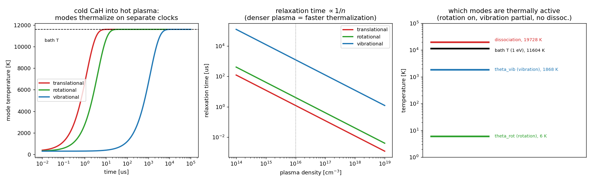

# Plasma thermalization

## `cah_thermalization.py` — multi-temperature relaxation of CaH



When cold CaH molecules meet a hot plasma, their energy modes **do not reach
equilibrium together**. Collisions thermalize translation almost immediately,
rotation after ~10 collisions, and vibration only after thousands — so the
molecule spends a long window as a genuinely *multi-temperature* object
(`T_vib ≫ T_rot ≈ T_tr`). That separation of timescales is the core of molecular
energy relaxation, and it shows up wherever molecules meet a plasma (tokamak
edge/divertor, molecular beams into discharges, astrophysical and cold-molecule
settings).

Modeled with the relaxation-time (Landau–Teller-style) approximation — one
temperature per mode relaxing to the bath at a mode-specific collision number `Z`
— using the **real CaH constants** (`ω_e = 1298 cm⁻¹`, `B_e = 4.23 cm⁻¹`,
`D₀ = 1.70 eV`).

```bash
python3 cah_thermalization.py
```

For cold CaH injected into a 1 eV, 10¹⁶ cm⁻³ plasma:

| mode | relaxation time |
|---|---|
| translational | 1.2 µs |
| rotational | 4.1 µs |
| vibrational | 1230 µs (~1000× slower) |

- **panel 1** — the three temperatures climbing to the bath on separate clocks
- **panel 2** — every relaxation time scales as `1/n`, so a denser plasma
  thermalizes proportionally faster (the ordering never changes)
- **panel 3** — the CaH energy ladder vs the bath: rotation is fully classical
  (`T_bath ≫ θ_rot ≈ 6 K`), vibration is partly excited (`T_bath ≈ 6 θ_vib`),
  and `T_bath < ` dissociation, so most molecules survive (~18% Boltzmann-tail
  dissociation at 1 eV)

## Interpretation & caveats

"Plasma thermalization" can mean several things; this implements the standard
**multi-temperature collisional relaxation** picture. Simplifications: constant
collision numbers `Z` (real V-T rates are strongly T-dependent, `τ_vib ~
exp(c·T^{-1/3})`), no rotation–vibration coupling or anharmonicity, an infinite
bath, and **neutral** CaH — if it were ionized to CaH⁺, translational
thermalization would run on the much faster Coulomb-collision clock instead.
Those are the natural knobs to specialize it to a specific experiment (see the
`NOTES` block).
