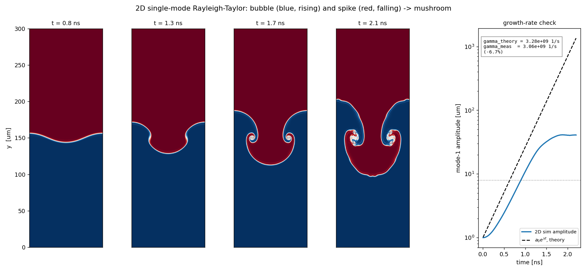

# Inertial Confinement Fusion — toy simulations

[](https://github.com/Sebastoshi/inertial-confinement-fusion/actions/workflows/ci.yml)

A growing set of small, self-contained Python models for building physical
intuition about **inertial confinement fusion (ICF)**. These are deliberately
*toy* models — a few hundred lines each, runnable on a laptop — not design
codes. The goal is to *feel* how an ICF implosion and its ignition threshold
behave, with every simplification written down.

Each model is quantitatively anchored (real DT fusion reactivity, the rocket
equation, textbook ignition criteria) and cross-checked against known results.

## Models

### [`0-D Hotspot/`](0-D%20Hotspot) — hot-spot ignition

A zero-dimensional DT hot spot balancing **alpha self-heating** against
**bremsstrahlung radiation**, with **alpha confinement** set by the areal
density ρR. Uses the Bosch–Hale fusion reactivity fit (accurate 0.2–100 keV).

It reproduces the two facts that define ICF ignition:
- an ignition **temperature** ≈ **4.35 keV** (where alpha heating overtakes radiation), and
- an ignition **areal density** ρR ≈ **0.3 g/cm²** (so the alphas actually stop).


The right panel is the point: burn-up is negligible, then jumps by orders of
magnitude over a ~1 keV window. That **ignition cliff** is why ICF is a
threshold phenomenon and so hard to hit.

### [`Rocket Implosion/`](Rocket%20Implosion) — thin-shell implosion

A lumped "rocket" model of the capsule implosion: the ablator blows off and, by
reaction, drives the shell inward to a huge velocity; a central gas cushion
decelerates it at stagnation. The output is fed straight into the hot-spot
ignition bar above.

For a NIF-scale toy target it delivers a self-consistent **igniting** design:

| quantity | value | note |
|---|---|---|
| implosion velocity | **345 km/s** | rocket equation predicts 345.4 (cross-check) |
| ablated fraction | 90% | payload = 10% of initial mass |
| kinetic energy | 17.9 kJ | NIF-scale |
| convergence ratio | 31 | R₀ / R_min |
| stagnation ρR | **2.27 g/cm²** | clears the 0.3 ignition bar |
| hot-spot temperature | **5.15 keV** | clears the 4.3 keV ignition bar |


### [`1-D Lagrangian Hydro/`](1-D%20Lagrangian%20Hydro) — resolved implosion

A spherical **1-D Lagrangian hydrodynamics** solve (staggered grid, artificial
viscosity, ideal-gas EOS). Instead of *estimating* stagnation, it *computes* it:
a driven shell implodes, launches a shock into the gas fill, and the shock
converges on the origin to form the hot spot — then rebounds.

It reaches a shock-heated hot spot of **10 keV** and **conserves energy to
≈1%** (the validity check). Being lossless and single-shock, it gets hot but not
dense (ρR stays low) — an honest illustration of what the ablative compression in
the models above actually buys you.


### [`Rayleigh-Taylor/`](Rayleigh-Taylor) — why it's actually hard

The instability the 1-D models can't show. The imploding shell is
**Rayleigh–Taylor unstable**: ripples grow exponentially and can shred it before
stagnation. Two scripts — the **mechanics** (dispersion relation, ablative
stabilization, e-foldings over the implosion) and a **2D simulation** that grows
a real bubble-and-spike mushroom and measures its growth rate.

The headline: a 5 nm ripple grows ×72 under *ablative* RT (shell survives) but
would grow ×13000 classically (shell breaks up) — ablation is what holds the
capsule together. The 2D sim's measured growth rate matches `√(A g k)` to ~7%.



### [`ML Surrogate/`](ML%20Surrogate) — the data-driven layer

Sample the rocket model across its design space, train a neural-network
**surrogate**, and get the ignition boundary, sensitivity, and inverse design
almost for free — the miniature version of LLNL's "cognitive simulation"
pipeline. The surrogate hits R² ≈ 0.99 on all outputs and classifies ignition at
~97%. The highlight is honest: the inverse-design optimizer first proposes an
over-optimistic design that the real simulator says **fizzles**, so the code does
what real ICF-ML does — verify, resample, retrain (**active learning**) — until
it lands a design **verified** to ignite.


### [`Lasers and Pulse Compression/`](Lasers%20and%20Pulse%20Compression) — the Xcimer Energy driver

Models of [Xcimer Energy](https://xcimer.energy)'s KrF inertial-fusion driver: a
**long-pulse KrF (248 nm) amplifier** (~µs, 96 kJ Argos-class), an **SBS
compression cell** in low-pressure noble gas (~140× compression at ~89%
efficiency, toward Xcimer's µs→3 ns / ~1000× target), and a comparison of
**excimer gas mixtures** (ArF / KrF / XeCl / XeF) showing why KrF at 248 nm is
the practical direct-drive choice.


### [`Plasma Thermalization/`](Plasma%20Thermalization) — molecular energy relaxation

Cold **CaH molecules** dropped into a hot plasma thermalize their translational,
rotational, and vibrational modes on wildly separated clocks (1.2 / 4 / 1230 µs)
— the multi-temperature relaxation picture, with real CaH spectroscopic
constants.


## Running

```bash
pip install -r requirements.txt
python3 "0-D Hotspot/hotspot_0d.py"
python3 "Rocket Implosion/rocket_implosion.py"
python3 "1-D Lagrangian Hydro/lagrangian_1d.py"
python3 "1-D Lagrangian Hydro/hydro_validation.py"   # verify the solver vs exact solutions
python3 "Rayleigh-Taylor/rt_mechanics.py"
python3 "Rayleigh-Taylor/rt_2d.py"
python3 "ML Surrogate/ml_ignition.py"                # needs scikit-learn
python3 "Lasers and Pulse Compression/excimer_laser.py"
python3 "Lasers and Pulse Compression/sbs_compression.py"
python3 "Lasers and Pulse Compression/excimer_mixtures.py"
python3 "Plasma Thermalization/cah_thermalization.py"
```

Each script prints its headline numbers and saves its figure alongside itself.
Every file has a `NOTES` block at the bottom listing the knobs to play with and
the physics that was deliberately left out.

## What's deliberately missing

These are toy models. The largest omissions, roughly in order of impact:
- radiation transport beyond optically-thin bremsstrahlung
- separate ion and electron temperatures; electron heat conduction
- real (Fermi-degenerate) EOS for the cold dense shell
- pulse shaping, cross-beam effects, laser–plasma instabilities
- fully coupled multi-dimensional radiation-hydro (the RT models are stand-alone)

## Roadmap

- [x] 1-D Lagrangian hydro (watch the shock converge and form the hot spot)
- [x] verify the solver against exact solutions (Sod / Noh / Sedov)
- [x] Rayleigh–Taylor growth on the imploding shell (mechanics + 2D sim)
- [x] ML surrogate + ignition boundary + inverse design (active learning)
- [x] on-ramp to real ICF simulation data (JAG) — see below
- [ ] multi-fidelity ML: transfer-learn from these toys onto MULTI runs
- [ ] couple the implosion output into a time-dependent burn

## Scaling up: real codes & data

These toys are for intuition and to learn the ML methodology on a system you
fully control. The natural next steps use real ICF tooling.

**Real simulation data — [JAG](https://github.com/LLNL/macc) (start here).**
LLNL's open ICF dataset: 10,000 semi-analytic implosion simulations, **5 physics
inputs → 15 scalar diagnostics + four 64×64 X-ray images**, MIT-licensed and
downloadable (`data/icf-jag-10k.tar.gz`). It has the same shape as the rocket
surrogate here (design → outcome), so the [`ML Surrogate`](ML%20Surrogate)
pipeline carries over almost directly — `ML Surrogate/jag_surrogate.py` does
exactly that, and is **verified end-to-end on the real 10k dataset: median test
R² = 0.999** across all 15 diagnostics. The one honest difference: JAG is a
*fixed dataset*, not a callable simulator, so surrogate proposals can't be
re-verified the way the rocket model's could — that gap is what a live code
(below) fills.

**Real mid-fidelity code — [MULTI-IFE](https://data.mendeley.com/datasets/cnrvy8czt7/1)
(Ramis, [CPC 2016](https://www.sciencedirect.com/science/article/abs/pii/S0010465516300297)).**
A 1-D spherical Lagrangian rad-hydro code with two-temperature plasma, laser
ray-tracing, multigroup radiation transport, **DT burn and alpha diffusion** —
the physics these toys omit. Free for academic use under the **CPC license (not
open-source — link to it, don't redistribute)**; Fortran, compiled locally.
Contact: Rafael Ramis, UPM. Use it as ground truth to benchmark the 1-D
Lagrangian solver here, and to generate burn-inclusive training data.

**The technique that connects them — transfer learning.** Pre-train a surrogate
on cheap low-fidelity data (these toys), fine-tune on a handful of expensive
high-fidelity runs (MULTI). See [Humbird et al., *Transfer Learning to Model ICF
Experiments*](https://www.semanticscholar.org/paper/Transfer-Learning-to-Model-Inertial-Confinement-Humbird-Peterson/25559fb4cadd3f1180bc998e0f25550da9eeb191)
and [*Transfer-learning design optimization for ICF* (arXiv 2205.13519)](https://arxiv.org/pdf/2205.13519).

---

*Toy models for learning, not for target design. Corrections welcome.*
