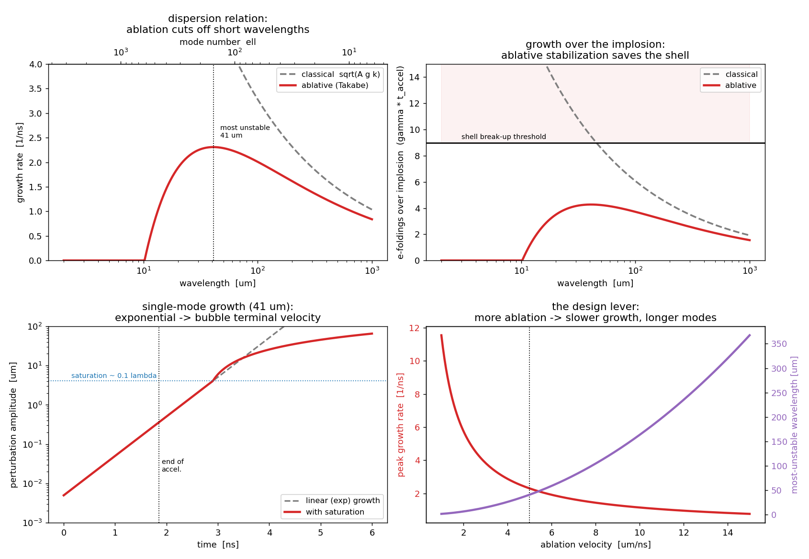
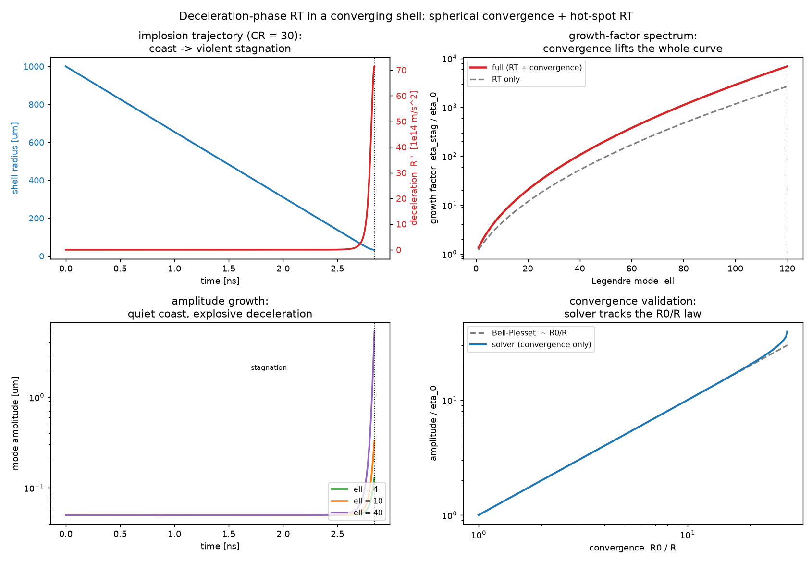
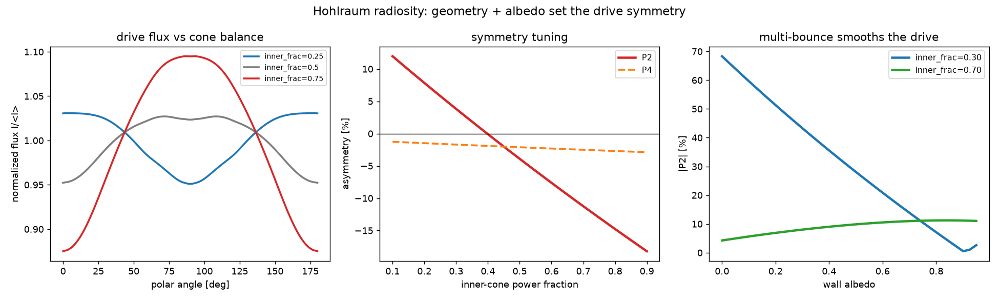
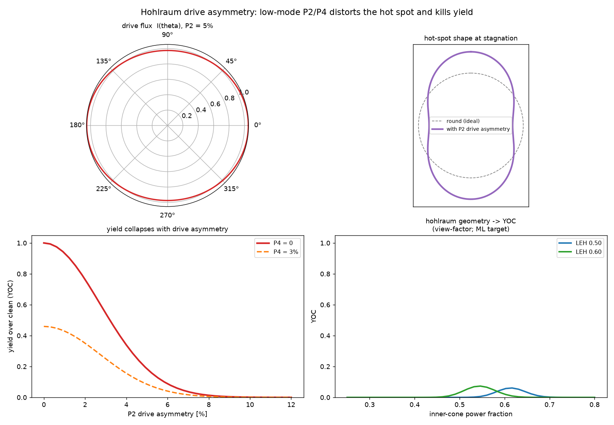
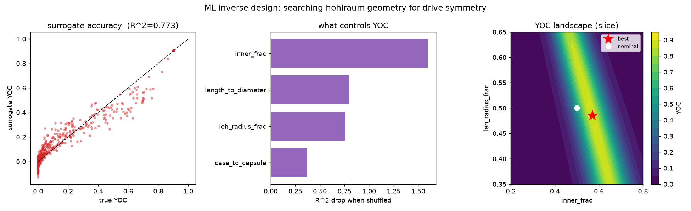

# Rayleigh–Taylor instability — why ICF is hard

The 1-D models make ignition look like a matter of hitting the right velocity
and areal density. Reality intervenes: the imploding shell is **Rayleigh–Taylor
unstable**. A light fluid pushing a heavy one (ablated plasma pushing the cold
shell; later the hot spot pushing the fuel) amplifies any ripple exponentially,
and left unchecked it shreds the shell before it can stagnate. This is the single
effect a 1-D code *cannot* show, and the one that most limits real implosions.

The first two scripts cover the **acceleration-phase ablation front in planar
geometry**: the mechanics (linear + weakly-nonlinear theory) and a real 2D
simulation that grows a mushroom and validates the theory. Four more then make it
*spherical, indirect-drive, and searchable* — the deceleration-phase hot-spot RT
with spherical convergence, a view-factor model of where hohlraum drive symmetry
comes from, the yield hit from low-mode drive asymmetry, and an ML search over
hohlraum geometry.

## `rt_mechanics.py` — the design constraints

```bash
python3 rt_mechanics.py
```



- **Dispersion relation** — classical `γ = √(A g k)` grows without bound at short
  wavelength; the **ablative (Takabe)** form `γ = α√(A g k) − β k V_ablation`
  cuts off short wavelengths and picks a single most-dangerous mode (~41 µm,
  mode ℓ ≈ 150 here).
- **The punchline** — over the ~1.85 ns implosion, a 5 nm surface ripple grows
  **×72** under ablative RT (to 0.36 µm — safely under the 40 µm shell). Without
  ablative stabilization the *same* ripple would grow **×13000** (66 µm) and
  **break the shell up**. Ablation is what holds ICF capsules together.
- **Nonlinear saturation** — exponential growth until ~0.1λ, then the bubble
  rises at a terminal velocity.
- **The design lever** — peak growth rate `∝ 1/V_ablation`: faster ablation gives
  a smoother implosion, at the cost of burning away more shell (the rocket-model
  trade).

## `rt_2d.py` — grow a real mushroom, and validate the rate

```bash
python3 rt_2d.py
```


A 2D incompressible Boussinesq simulation (vorticity–streamfunction, FFT Poisson
solve, semi-Lagrangian advection): heavy on light, a single-mode ripple, gravity.
The ripple grows into the classic **bubble** (light, rising) and **spike**
(heavy, falling), and the spike flanks roll up via Kelvin–Helmholtz into the
mushroom cap.

Then the validation: it measures the early-time growth rate off the flow and
compares to linear theory —

| | value |
|---|---|
| linear theory `√(A g k)` | 3.28 × 10⁹ s⁻¹ |
| measured from the 2D flow | 3.06 × 10⁹ s⁻¹ |
| **agreement** | **−6.7%** |

The residual is honest and visible in the growth-rate panel: the amplitude starts
*below* the exponential (it begins as `cosh(γt)` because the flow starts from
rest), plus the starting interface has finite thickness. Both suppress the
measured rate slightly. Matching `√(A g k)` ties this sim back to the dispersion
relation the mechanics script is built on — change `LAM` and both track together.

## Beyond the ablation front: convergence, the hot spot, and the hohlraum

The two scripts above are planar and acceleration-phase. Real indirect-drive ICF
is spherical, it stagnates, and it is driven by X-rays from a hohlraum. Four more
models add exactly those pieces — and then let an optimizer search them.

### `convergent_rt.py` — deceleration-phase RT in a converging shell

```bash
python3 convergent_rt.py
```



Integrates an implosion trajectory (coast → adiabatic-gas stagnation, auto-tuned
to convergence ratio CR = 30) and grows a linear mode along it, adding two effects
a planar code cannot show:

- **Deceleration-phase RT** — at stagnation the hot spot (light) decelerates the
  dense shell (heavy); the effective gravity `g_eff = R''` (peak ≈ **37× the
  acceleration-phase g**) turns the hot-spot interface unstable. There is no mass
  ablation here, so **no Takabe stabilization** saves it — this is the RT that
  mixes cold fuel into the hot spot and quenches ignition.
- **Spherical convergence (Bell–Plesset)** — a mode amplitude grows geometrically
  `~ R₀/R` even without RT, and `k = ℓ/R` sweeps upward as the shell shrinks.

Two limits are checked and printed, anchoring the reduced model:

| limit | expected | solver |
|---|---|---|
| planar RT | `γ = √(A g k)` | **−0.0 %** |
| pure convergence | `η ∝ R₀/R` (Bell–Plesset) | tracks it (panel 4) |

### `hohlraum_viewfactor.py` — where the drive symmetry comes from

```bash
python3 hohlraum_viewfactor.py
```



A **multi-bounce radiosity** calculation of the X-ray flux a gold hohlraum
delivers to the capsule. The wall re-emits a fraction (the **albedo**, ~0.85) of
every X-ray that lands on it, so the radiation bounces many times before it
escapes the LEH or is absorbed by the capsule — and that is what smooths the
drive. The transport is solved as a linear radiosity system over axisymmetric
rings (`P = E + albedo·VFᵀ·P`), then the equilibrium wall brightness is integrated
onto the capsule and decomposed into Legendre modes. Validated by construction:

- **odd modes vanish** to ~1e-16 (top/bottom symmetry),
- **raising the albedo smooths the drive** — at a fixed cone imbalance `|P2|` falls
  from ~68 % (single-bounce, `albedo = 0`) to a few percent by `albedo ≈ 0.9`,
- **inner/outer cone balance tunes P2 through zero** (symmetric at `inner_frac ≈ 0.40`),
- a **bigger LEH → colder poles → P2 drops**.

`symmetry(geometry) → (a2, a4, a6)` is the map the next two scripts consume.

### `hohlraum_asymmetry.py` — from drive asymmetry to lost yield

```bash
python3 hohlraum_asymmetry.py
```



Low-mode P2/P4 drive asymmetry → a velocity asymmetry → a ballistic offset,
amplified by the convergent-RT growth factors, distorts the hot spot into a peanut.
The distortion then feeds the **repo's own 0-D ignition model** (`0-D Hotspot/`):
residual kinetic energy lowers the hot-spot temperature, the thin peanut waist
lowers the confining areal density, and the yield is the burn-up fraction of that
degraded hot spot relative to a round one. **The sharp YOC collapse is the
ignition cliff, not a fitted curve:**

| P2 drive asymmetry | 1 % | 2 % | 5 % |
|---|---|---|---|
| YOC | 0.72 | 0.35 | 0.02 |

A percent or two is enough to fall off the cliff — which is *why* NIF holds drive
symmetry to sub-percent. `performance(a2, a4, a6)` is the objective the ML samples.

### `hohlraum_ml.py` — search the geometry for better symmetry

```bash
python3 hohlraum_ml.py
```



The full chain `geometry → view-factor symmetry → hot-spot shape → YOC` is a cheap,
deterministic forward model. A scikit-learn `MLPRegressor` surrogate (Latin-hypercube
samples) plus a `differential_evolution` active-learning loop searches the 4-D
geometry space (case-to-capsule, length/diameter, LEH size, cone balance):

- **nominal design → YOC 0.03** (asymmetric drive → off the ignition cliff);
- **ML-found design → YOC ≈ 0.90** (a symmetric geometry, a2 ≈ −0.1 %, a4 ≈ −0.3 %) — a **+88-point** gain;
- **permutation importance**: cone balance ≫ aspect ratio ≈ LEH size > case-to-capsule.

The best YOC caps below 1 because even sub-percent residual a4 costs yield through
the ignition cliff — honest, and exactly why real designs chase symmetry so hard.
The ML doesn't replace the physics — it *learns* it, searches it, and verifies
every proposed optimum against the real forward model (surrogate test R² ≈ 0.77).

## What this is and isn't

Captures the instability **mechanism** and its linear growth rate. Not an
ICF-accurate mixing layer: incompressible Boussinesq (real fronts are
compressible and high-Atwood), single mode (no mode coupling or turbulent mix),
and 2D. The ablative *stabilization* — the physics that actually saves the
implosion — lives in the mechanics script, not the 2D sim. The spherical models
are reduced too: a linear thin-interface convergence ODE, a grey/static/diffuse
radiosity view factor (no time-dependent symmetry swing, spectral transport, or
cross-beam energy transfer), a 0-D single-temperature ignition model, and linear
drive→shape transfer. Each script's `NOTES` block lists the knobs and the
simplifications. The point is that the ML wrapper is unchanged when any physics
stage is upgraded — as it already was twice, swapping a heuristic yield for the
0-D ignition cliff and a single-bounce view factor for multi-bounce radiosity.
