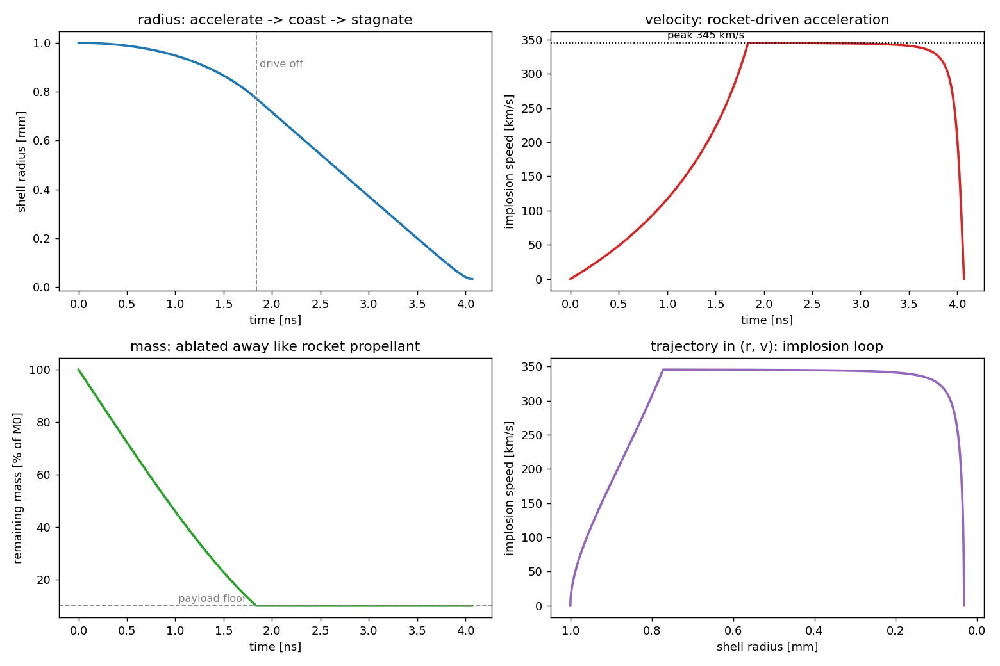

# Thin-shell rocket implosion

A lumped "rocket" model of an ICF capsule implosion. The ablator blows off and,
by reaction, drives the shell inward to a huge velocity; a central adiabatic gas
cushion decelerates it at stagnation. The stagnation conditions are fed straight
into the ignition bar from the [0-D hot-spot model](../0-D%20Hotspot).

```bash
python3 rocket_implosion.py
```



**Three phases** (visible across the four panels): rocket-driven acceleration →
coast → stagnation on the central gas.

**Results for a NIF-scale toy target — it ignites:**

| quantity | value | note |
|---|---|---|
| implosion velocity | 345 km/s | rocket equation predicts 345.4 (cross-check) |
| ablated fraction | 90% | payload = 10% of initial mass |
| kinetic energy | 17.9 kJ | NIF-scale |
| convergence ratio | 31 | R₀ / R_min |
| stagnation ρR | 2.27 g/cm² | clears the 0.3 g/cm² bar |
| hot-spot temperature | 5.15 keV | clears the 4.3 keV bar |

The rocket equation `v = v_ex · ln(M₀/M_payload)` is printed next to the
simulated velocity and matches to 0.1 km/s, confirming the dynamics.

Knobs and the biggest simplification — **no Rayleigh–Taylor instability**, the
effect that most limits real implosions — are documented in the `NOTES` block at
the bottom of `rocket_implosion.py`.
